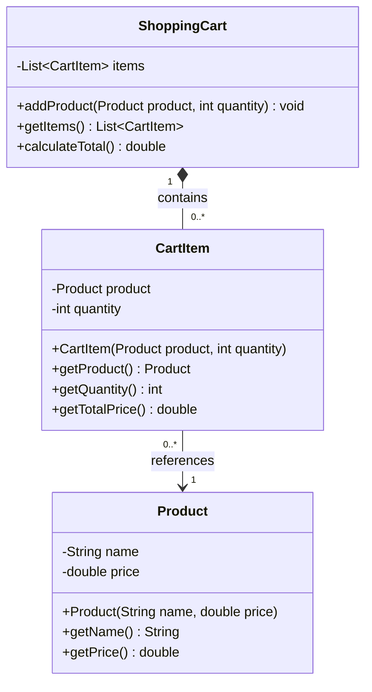

# Shopping Cart - Lista 1 (Zadanie 7)

## Diagram klas UML

```mermaid
classDiagram
    class Product {
        -String name
        -double price
        +Product(String name, double price)
        +getName() String
        +getPrice() double
    }

    class CartItem {
        -Product product
        -int quantity
        +CartItem(Product product, int quantity)
        +getProduct() Product
        +getQuantity() int
        +getTotalPrice() double
    }

    class ShoppingCart {
        -List~CartItem~ items
        +addProduct(Product product, int quantity) void
        +getItems() List~CartItem~
        +calculateTotal() double
    }

    ShoppingCart "1" *-- "0..*" CartItem : contains
    CartItem "0..*" --> "1" Product : references
```